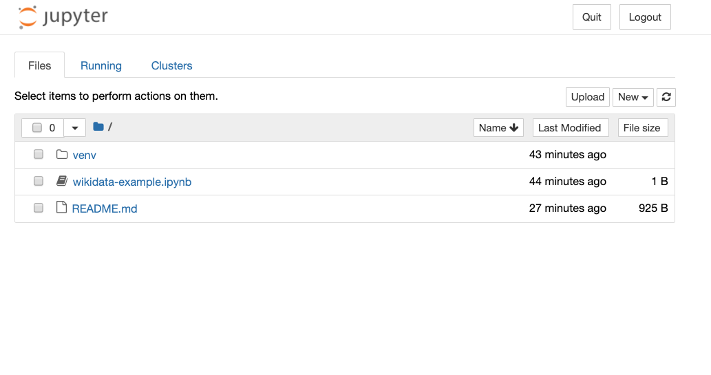

# JSTOR Labs software developer project

## Project description

The project assignment is to develop a [jupyter notebook](https://jupyter.org/) that uses data queried from the [Wikidata](https://www.wikidata.org) knowledge graph to generate table(s) and/or other visualization(s) with the queried data.  The subject of the data queried and resulting output is completely open and can be anything from the serious to the whimsical.

It is expected that the project would require approximatey 4 hours of effort.  The output will be a single jupyter notebook that will be shared with us via a [Binder](https://mybinder.org/) link to an executable version of the notebook.  The notebook should include any necessay documentation to describe the subject of the query and the steps involved in going from the general idea to the generated output.  The [included example](wikidata-example.ipynb) can be used for general guidance.

The project covers a few objecives:

1. Your ability to use a public API with python
2. Demonstration of your ability to quickly learn something that is potentially unfamiliar, like SPARQL and Jupyter notebooks
3. Creativity in selecting a subject and displaying the output
4. Communication skills in describing the approach and presenting the results 

After the project has been completed and submitted to us we will schedule a video call in which you will describe your process and the solution.  This is expected to take 30 minutes or less.  Following the presentation of the project solution there will be time for general discssion and Q/A with the team.

## Background

### Wikidata

[Wikidata](https://www.wikidata.org) is an open knowledge graph consisting of nearly 90 million entities.  Wikidata has rapidly become one of the largest and most important respositories of Linked Open Data [(LOD)](https://en.wikipedia.org/wiki/Linked_data) in the evolution of the [semantic web](https://en.wikipedia.org/wiki/Semantic_Web) first described by Tim Berners-Lee in 1999.  The semantic web envisions the internet as more than just human readable web pages but as a global database of semantic data that can also be consumed by machines.  Wikidata provides a [public endpoint](https://query.wikidata.org/) through which [SPARQL](https://en.wikipedia.org/wiki/SPARQL) queries are submitted to obtain results.

In considering a subject for the project the queries on the [Wikidata examples](https://www.wikidata.org/wiki/Wikidata:SPARQL_query_service/queries/examples) page might be useful as both a source of inspiration and SPARQL syntax samples.

### Jupyter notebooks

Jupyter notebooks provide web-based execution environments for a variety of programming languages including Python, R, and Julia.  The notebooks support the mixing of executable code snippets and formatted documentation (in [Markdown](https://www.markdownguide.org/getting-started/)).  Jupyter notebooks were intially used as a tool used by data scientists to easily share analyses and dashboards but in recent years are now used for many other purposes, including teaching and learning.

### Binder

[Binder](https://mybinder.org/), among other things, provides an environment for executing Jupyter notebooks stored in a Github repository.

## Environment setup

This is not intended to be an exhustive tutorial on setting up a local environment but rather describes what I did (on a Macbook) in case the general approach is useful to get started.

### Fork the JSTOR-Labs sw-dev-project code

From the [sw-dev-project](https://github.com/JSTOR-Labs/sw-dev-project) Github repository, use the `Fork` option (using the button at the top right of the page) to make a copy of this repository in your own account.

### Clone the forked repository on your local computer

```bash
git clone git@github.com:YOUR_ACCOUNT/sw-dev-project.git
```

### Create and activate python virtual environment

```bash
cd sw-dev-project
/usr/local/bin/python3 -m venv venv
source venv/bin/activate
```

### Install jupyter notebook software and other dependencies

```bash
pip install notebook
pip install requests matplotlib
```

### Start the jupyter notebooks server

   ```bash
   jupyter notebook
   ```

If everything has been successful up to this point you should see the following page in your browser:



## Develop your project solution

The notebook for your project solution should be created in your
forked repository.  Copying/renaming the example notebook to get
started might be helpful.

After the project notebook has been completed don't forget to push the finished version to your forked repository.

## Sharing the completed project code

In the forked repository update the URL associated with this Binder button to reflect your Github account.  Replace `JSTOR-Labs` with your account name.  This button is useful for launching the entire repository in Binder with executable notebooks.

[](https://mybinder.org/v2/gh/JSTOR-Labs/sw-dev-project/master)

This updated URL is also the link to share with us after the project has been completed.